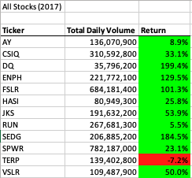
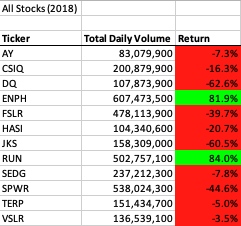
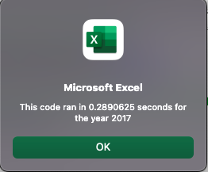
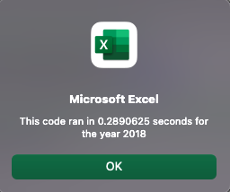

# Stock Analysis using VBA

Performing analysis on green energy stocks to unveil trends.

## Overview of Project

The purpose of this analysis is to compare annual returns of green energy stocks. In this particular analysis, it compares the performance for the years 2017 and 2018. To find these results, VBA, known as Visual Basic for Applications, was used to retrieve the following: the ticker, total daily volume and return. Then, the original code was refactored in order to expand the dataset to include the entire stock market rather than the 12 stocks used for the original code. 

## Results

If we look at the stock returns for each year, 2017 across the board had net positive returns while 2018 had net negative returns. From an investor's perspective, this would indicate a risky investment as there is no clear pattern of returns YoY. For instance, if we look at the DQ stock, in 2017 the stock rises almost 200 percent and then falls 62 percent the following year. These are both drastic changes in the stock YoY. It would be unwise to invest in any of these stocks and expect a positive return in any given year. However, more data is needed to see how these stocks perform over a long period of time. In addition, the high volume of the stocks would indicate that the stocks should be relatively stable.

### The Original Code

Here is a snapshot of the original code used for the analysis. Each step is broken down for what the code is doing.

0) Create message box and timer for analysis for each year

        Sub AllStocksAnalysis()

        Dim startTime As Single
        Dim endTime As Single
    
        yearValue = InputBox("What year would you like to run the analysis on?")
    
        startTime = Timer

'1) Format the output sheet on All Stocks Analysis

    Worksheets("All Stocks Analysis").Activate

    'Worksheet Title
    Range("A1").Value = "All Stocks (" + yearValue + ")"
    
    'Header Row
    Cells(3, 1).Value = "Ticker"
    Cells(3, 2).Value = "Total Daily Volume"
    Cells(3, 3).Value = "Return"
    
 '2) Initialize array of all tickers
 
    'Creating an array
    Dim tickers(11) As String
    
    tickers(0) = "AY"
    tickers(1) = "CSIQ"
    tickers(2) = "DQ"
    tickers(3) = "ENPH"
    tickers(4) = "FSLR"
    tickers(5) = "HASI"
    tickers(6) = "JKS"
    tickers(7) = "RUN"
    tickers(8) = "SEDG"
    tickers(9) = "SPWR"
    tickers(10) = "TERP"
    tickers(11) = "VSLR"
    
'3a) Initialize variables for starting price and ending price

        Dim startingPrice As Double
        Dim endingPrice As Double
        
'3b) Activate data worksheet

    Worksheets(yearValue).Activate

'3c) Get the number of rows to loop over

    RowCount = Cells(Rows.Count, "A").End(xlUp).Row
    
'4) Loop through tickers
    
    For i = 0 To 11
    
        ticker = tickers(i)
        totalVolume = 0
        
        '5) loop through rows in the data
        Worksheets(yearValue).Activate
        For j = 2 To RowCount
            '5a) Get total volume for current ticker
                    If Cells(j, 1).Value = ticker Then
                    
                        totalVolume = totalVolume + Cells(j, 8).Value
                        
                        End If
            '5b) get starting price for current ticker
                    If Cells(j - 1, 1).Value <> ticker And Cells(j, 1).Value = ticker Then
        
                         startingPrice = Cells(j, 6).Value
            
                     End If
            '5c) get ending price for current ticker
                     If Cells(j + 1, 1).Value <> ticker And Cells(j, 1).Value = ticker Then
        
                         endingPrice = Cells(j, 6).Value
            
                     End If
        
        Next j
        
   '6) Output data for current ticker

        Worksheets("All Stocks Analysis").Activate
        Cells(4 + i, 1).Value = ticker
        Cells(4 + i, 2).Value = totalVolume
        Cells(4 + i, 3).Value = endingPrice / startingPrice - 1
    
        Next i
    
'7) Formatting the data table

    Worksheets("All Stocks Analysis").Activate

    Range("A3:C3").Font.Bold = True
    Range("A3:C3").Borders(xlEdgeBottom).LineStyle = xlContinuous
    Range("B4:B15").NumberFormat = "#,##0"
    Range("C4:C15").NumberFormat = "0.0%"
    Columns("B").AutoFit

    'Conditional Formatting
    If Cells(4, 3) > 0 Then

    'Color the Cell green
    Cells(4, 3).Interior.Color = vbGreen
    
    ElseIf Cells(4, 3) < 0 Then

    'Color the Cell red
    Cells(4, 3).Interior.Color = vbRed
    
    Else

    'Clear the cell color
    Cells(4, 3).Interior.Color = xlNone
    
    End If

    'Setting up the loop

    dataRowStart = 4
    dataRowEnd = 15

    For i = dataRowStart To dataRowEnd

    If Cells(i, 3) > 0 Then
    
    'Color the Cell Green
    Cells(i, 3).Interior.Color = vbGreen
    
    ElseIf Cells(i, 3) < 0 Then
    
    'Color the Cell Red
    Cells(i, 3).Interior.Color = vbRed
    
    Else
    
    'Clear the cell color
    Cells(i, 3).Interior.Color = xlNone
    
    End If

    Next i
    
        endTime = Timer
        MsgBox "This code ran in" & (endTime - startTime) & "seconds for the year" & (yearValue)
    
    End Sub

### The Refactored Code, What changed?

Before we dive in to the code itself, it's important to understand what refactoring actually is and the purpose of doing it. Refactoring is a common practice used in the coding world to make the code cleaner (eliminating DRY code) and/or making it more efficient. Below is a snapshot of what the refactored code looks like. For reference, a starter code template was used to outline the steps for refactoring. 

    Sub AllStocksAnalysisRefactored()
    
    'Creating Input Box to select year to run analysis on and timer for how long code takes
    
    Dim startTime As Single
    Dim endTime  As Single

    yearValue = InputBox("What year would you like to run the analysis on?")

    startTime = Timer
    
    'Format the output sheet on All Stocks Analysis worksheet
    Worksheets("All Stocks Analysis").Activate
    
    Range("A1").Value = "All Stocks (" + yearValue + ")"
    
    'Create a header row
    Cells(3, 1).Value = "Ticker"
    Cells(3, 2).Value = "Total Daily Volume"
    Cells(3, 3).Value = "Return"

    'Initialize array of all tickers
    Dim tickers(12) As String
    
    tickers(0) = "AY"
    tickers(1) = "CSIQ"
    tickers(2) = "DQ"
    tickers(3) = "ENPH"
    tickers(4) = "FSLR"
    tickers(5) = "HASI"
    tickers(6) = "JKS"
    tickers(7) = "RUN"
    tickers(8) = "SEDG"
    tickers(9) = "SPWR"
    tickers(10) = "TERP"
    tickers(11) = "VSLR"
    
    'Activate data worksheet
    Worksheets(yearValue).Activate
    
    'Get the number of rows to loop over
    RowCount = Cells(Rows.Count, "A").End(xlUp).Row
    
    '1a) Create a ticker Index
    tickerIndex = 0

    '1b) Create three output arrays
    Dim tickerVolumes(12) As Long
    Dim tickerStartingPrices(12) As Single
    Dim tickerEndingPrices(12) As Single
    
    ''2a) Create a for loop to initialize the tickerVolumes to zero.
    For i = 0 To 11
        tickerVolumes(i) = 0
        tickerStartingPrices(i) = 0
        tickerEndingPrices(i) = 0
    
    Next i
        
    ''2b) Loop over all the rows in the spreadsheet.
    For i = 2 To RowCount
    
        '3a) Increase volume for current ticker
        tickerVolumes(tickerIndex) = tickerVolumes(tickerIndex) + Cells(i, 8).Value
        
        '3b) Check if the current row is the first row with the selected tickerIndex.
        
         If Cells(i, 1).Value = tickers(tickerIndex) And Cells(i - 1, 1).Value <> tickers(tickerIndex) Then
            tickerStartingPrices(tickerIndex) = Cells(i, 6).Value
            
       
        End If
        
        '3c) check if the current row is the last row with the selected ticker
         'If the next row’s ticker doesn’t match, increase the tickerIndex.
       
         If Cells(i, 1).Value = tickers(tickerIndex) And Cells(i + 1, 1).Value <> tickers(tickerIndex) Then
            tickerEndingPrices(tickerIndex) = Cells(i, 6).Value
            
        End If
            '3d Increase the tickerIndex.
          If Cells(i, 1).Value = tickers(tickerIndex) And Cells(i + 1, 1).Value <> tickers(tickerIndex) Then
            tickerIndex = tickerIndex + 1
            
        End If
   
    Next i
    
    '4) Loop through your arrays to output the Ticker, Total Daily Volume, and Return.
    For i = 0 To 11
        
        Worksheets("All Stocks Analysis").Activate
        Cells(4 + i, 1).Value = tickers(i)
        Cells(4 + i, 2).Value = tickerVolumes(i)
        Cells(4 + i, 3).Value = tickerEndingPrices(i) / tickerStartingPrices(i) - 1
        
    Next i
    
    'Formatting
    Worksheets("All Stocks Analysis").Activate
    Range("A3:C3").Font.FontStyle = "Bold"
    Range("A3:C3").Borders(xlEdgeBottom).LineStyle = xlContinuous
    Range("B4:B15").NumberFormat = "#,##0"
    Range("C4:C15").NumberFormat = "0.0%"
    Columns("B").AutoFit

    dataRowStart = 4
    dataRowEnd = 15

    For i = dataRowStart To dataRowEnd
        
        If Cells(i, 3) > 0 Then
            
            Cells(i, 3).Interior.Color = vbGreen
            
        Else
        
            Cells(i, 3).Interior.Color = vbRed
            
        End If
        
    Next i
 
    endTime = Timer
    MsgBox "This code ran in " & (endTime - startTime) & " seconds for the year " & (yearValue)

    End Sub

At first glance it is difficult to spot the differences, but there a few changes that are made that help this code run faster (almost 5x as fast to be exact). The first difference to be noticed is the addition of variables: tickerIndex, tickerVolumes, tickerStartingPrices and tickerEndingPrices. When we put these variables, aside from tickerIndex, in an output array, it eliminates the need for a nested loop used in the original code once variables are initialized. Now, instead of nesting a for loop through the rows inside of the ticker array, we can use these variables to create a separate for loop. 

## Summary

### Advantages and Disadvantages of Refactoring

**Advantages**

One of the main pros to refactoring is that it helps the code run faster (see below for run times of refactored code). Compared to the original code which ran in approximate 1 second, the refactored code ran in 0.25 seconds (approximately 5x faster). Another advantage is that the design is easier to understand. Even though much of the code wasn't changed when refactored, the addition of the output arrays: tickerVolumes, tickerStartingPrices and tickerEndingPrices, makes the code more comprehensible. Last, the refactored code is able to handle a larger dataset (thousands of stocks vs. a dozen stocks). 

**Disadvantages**

The main disadvantage or risk of using refactored code is trying to apply refactored code when there is no use case. In this analysis, a starter code with step by step instructions was provided to help guide the refactoring process. 

### The Application

Ultimately, refactoring the original code for finding the yearly return for green energy stocks brought three improvements. 1) A faster solution 2) Code that can handle a larger dataset. 3) A more comprehensible design. 

## References

1) *Module 2 Challenge*. Bootcamp Spot. (n.d.). Retrieved December 15, 2022, from https://bootcampspot.com/ 

2) *What are the advantages and disadvantages of refactoring code smell in software quality?* Stack Overflow. (n.d). Retrieved December 14, 2022, from https://stackoverflow.com/questions/43983284/what-are-the-advantages-and-disadvantages-of-refactoring-code-smell-in-software 

## Additional Info about VBA functionality 

[For Loops](https://learn.microsoft.com/en-us/office/vba/language/concepts/getting-started/looping-through-code)

[Variables](https://learn.microsoft.com/en-us/office/vba/language/concepts/getting-started/declaring-variables)

[Arrays](https://learn.microsoft.com/en-us/dotnet/visual-basic/programming-guide/language-features/arrays/)

[Conditional Formatting](https://learn.microsoft.com/en-us/office/vba/api/Excel.FormatCondition)
